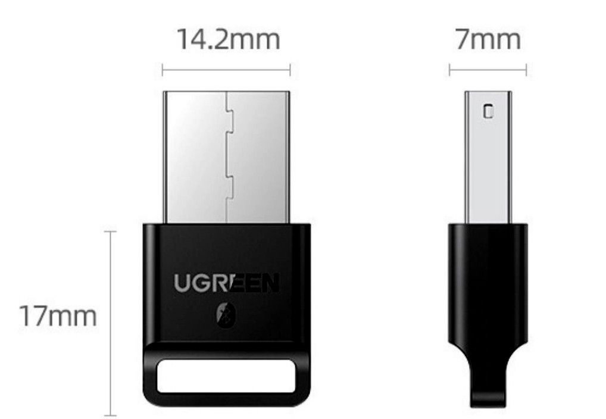

# 0. What's wrong with my bluetooth adapter?



This bluetooth adapter works perfectly on PC of Windows 10 but Ubuntu20.

# 1. A possible cause and its solution
## 1.1 Checking the error message of it
```bash
$ dmesg | grep -i bluetooth
rtl_bt/rtl8761b_fw.bin not found
```
If under this condition, what we need is the file `rtl_bt/rtl8761b_fw.bin` on the right postion.


## 1.2 Downloading the files and setting them right
+ Downloading files `rtl8761b_fw` and `rtl8761b_config` from [here](https://github.com/Realtek-OpenSource/android_hardware_realtek/tree/rtk1395/bt/rtkbt/Firmware/BT)
+ Copying them to `/usr/lib/firmware/rtl_bt/`
    ```bash
    $ cp rtl8761b_fw /usr/lib/firmware/rtl_bt/rtl8761b_fw.bin
    $ cp rtl8761b_config /usr/lib/firmware/rtl_bt/rtl8761b_config.bin
    ```
    ATTENTION! DO NOT forget suffix `.bin` when copying.

# 2. References
[技术总结《在Ubuntu中使用USB蓝牙适配器》](https://www.meltycriss.com/2021/12/29/tech-ubuntu-bluetooth/)
[USB5.0蓝牙发射器在Ubuntu 18.04上的安装和使用](https://zhuanlan.zhihu.com/p/347415832)